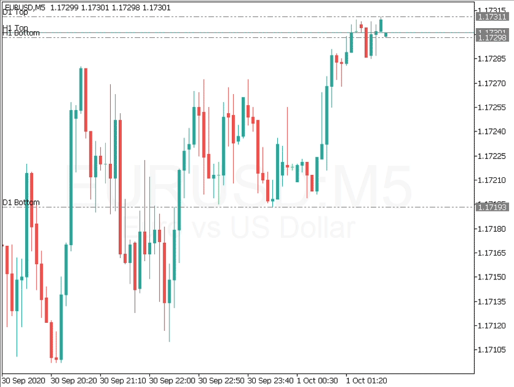
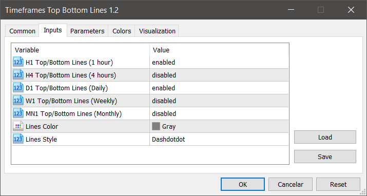

## MetaTrader 5 > Utility > Timeframes Top/Bottom Lines



### Description

This utility tool draws timeframes top/bottom horizontal named lines on the chart, which highlight important regions and can assist in decision making for trading.

### Settings



#### Inputs

* **Top/Bottom Lines: H1 (1 hour), H4 (4 hours), D1 (Daily), W1 (Weekly), MN1 (Monthly)**: You can choose to enable or disable timeframes top/bottom horizontal named lines.
* **Lines Color**: You can choose your favorite from the available colors or type in a custom RGB color (values from 0 to 255, eg: 100, 128, 255).
* **Lines Style**: You can  choose between "Solid", "Dash", "Dot", "Dashdot", "Dashdotdot".

---

```Obs: The option "Charts > Properties > Show > Show object descriptions" MUST be checked in order to display the labels on the lines.```

---

### Instructions

1. Copy this project folder to your **MetaEditor** indicator folder.
2. Select the *.mq5* file and click *'Compile'* button on **MetaEditor**.
3. On **MetaTrader**, insert this compiled indicator into the chart you want.

---

### References

* [MQL5 Documentation](https://www.mql5.com/en/docs)

### MQL5 Market

* [My MQL5 Published Products](https://www.mql5.com/en/users/leonardo_splinter/seller)
